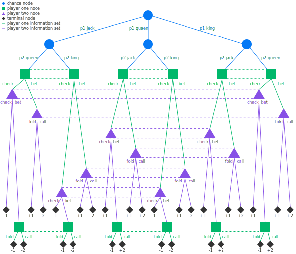

# ACC-CS-CLUB-ML
Austin community college computer science club group machine learning project for poker and hidden information games

# Welcome
Welcome to the ACC CS poker ML group projects. Do get started, please read [contributing.md](docs/contributing.md)

# Goals
The goal of NitDestroyer is to find a Nash Equilibrium for poker. We will begin with Kuhn Poker and gradually move up to Rhode Island Hold'em (RIH), Limit Texas Hold'em (LTH), and No Limit Texas Hold'em (NLTH). We are specifically targeting cash game play, but will also be looking at tournament play.

# Rescources and References
[Kuhn Poker Rules](https://en.wikipedia.org/wiki/Kuhn_poker)

[Rhode Island Hold'em Rules](https://www.cs.cmu.edu/~gilpin/gsi.html)
[Limit Texas Hold'em Rules](https://www.pokerlistings.com/limit-texas-holdem)
[No Limit Texas Hold'em Rules](https://www.thepokerbank.com/articles/basics/rules/)
[Noam Brown's Libratus overview video](https://www.youtube.com/watch?v=2dX0lwaQRX0)
[Noam Brown's Libratus paper](https://www.cs.cmu.edu/~noamb/papers/17-IJCAI-Libratus.pdf)
[Meta's Pluribus paper](https://www.science.org/doi/10.1126/science.aay2400)
[Deep Counterfactual Regret Minimization](https://arxiv.org/pdf/1811.00164.pdf)

# Roadmap
[Github Project Board](https://github.com/users/quac88/projects/2/views/1)
- [x] Create a repositorys
- [x] Setup PR permisions
- [x] Create version control
- [x] Create [contributing.md](docs/contributing.md) rules and PR template
- [x] Choose a playing card emulator
- [x] Build a poker module from scratch (player class, game class, etc.)
- [x] Create a poker emulator from scratch
- [x] Write unit tests
- [x] Build a data logger
- [ ] Build Kuhn Poker
- [ ] Solve Kuhn Poker
- [ ] Brainstorm data collection and storage
- [ ] Create randomized player agents
- [ ] Begin ML training on randomized player agents (ultra simple algorithm)
- [ ] Improve ML algorithim (Monte Carlo Counterfactual Regret Minimization)
- [ ] Create Baselines